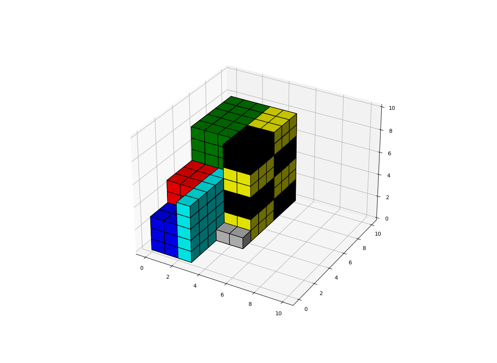

# will_it_fit?

## A program to automatically place 3-dimensional objects inside of a 3-dimensional space
### Have you ever been packing a storage unit and wondered: will all of my items fit? I sure have! I wrote this program to find out.

Current status: *in progress*

Figures directory includes examples of objects plotted manually

"storage_math_#.ipynb" files describe algorithm for searching and updating search space as objects are placed

